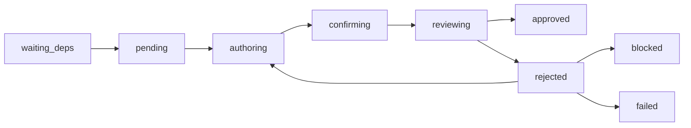
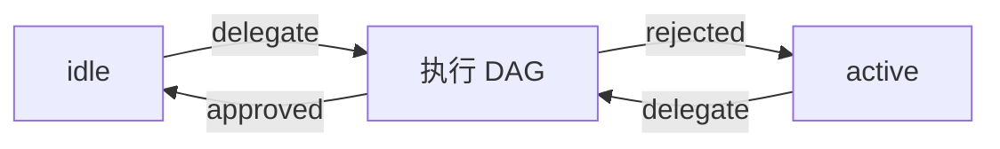

# Squad-Tau PRD — 02 Squad 编排引擎

## 2.1 命令

| 命令 | 描述 |
|------|------|
| `/squad <task>` | 向 LLM 下达任务，要求准备 `.toml` 文件并调用 `delegate`；强制 LLM 不得静默结束 |
| `/squad-models` | 生成初始模型池配置 |

> `/squad` **不启动任何服务**。HTTP/WS 服务器在插件加载时即启动，Web UI 始终可用。`delegate` 工具全局注册，LLM 可随时自主调用。

## 2.2 执行模式

### M 模式（单节点）
- 适合内聚的多文件变更
- 目录中只有一个 `.toml` 文件
- 流程：Worker → Self-Confirm → Reviewer → Approved

### L 模式（多节点 DAG）
- 适合模块化并行工作
- 目录中有多个 `.toml` 文件
- 流程：拓扑排序 → 分层并发执行 → 外层 review 循环

## 2.3 delegate 参数

```typescript
delegate({ plan_dir: string })
```

`plan_dir` 指向一个目录，内含每个节点一个 `.toml` 文件。Agent 先在临时目录准备这些文件，再调用 `delegate`。

- 目录中 **只有一个** `.toml` 文件 → **M 模式**（单节点）
- 目录中 **有多个** `.toml` 文件 → **L 模式**（多节点 DAG）

### 节点文件格式（文件名即节点 ID）
```toml
# auth-base.toml
task = "Implement authentication base layer..."
depends_on = []

[[review_criteria]]
name = "Correctness"
description = "Handles all edge cases correctly"

[[review_criteria]]
name = "Security"
description = "No injection or auth bypass"

# login.toml
task = "Build login UI..."
depends_on = ["auth-base"]

[[review_criteria]]
name = "Design"
description = "Follows design system"
```

### 字段约束（所有字段必填）

| 字段 | 类型 | 说明 |
|------|------|------|
| `task` | string | **必须详细具体**，包含问题背景、目标、工作方法（如 TDD）、参考材料、注意事项等。LLM 准备文件时应尽可能细致 |
| `depends_on` | string[] | **必填**，独立节点填 `[]`，依赖节点填其他文件名（不含 `.toml` 后缀），构成 DAG |
| `review_criteria` | table[] | `[[review_criteria]]` 表数组，每项含 `name` + `description`，`description` 必须原样嵌入提示词（Worker/Confirm/Reviewer 均展开为 `name: description`） |

### 设计理由
- 避免 LLM 输出截断（复杂 plan 可拆到多个 `.toml` 文件）
- 文件数决定 M/L 模式，无需额外配置
- LLM 使用系统临时目录准备

## 2.4 节点生命周期



### 状态说明

| 状态 | 含义 |
|------|------|
| `waiting_deps` | 依赖未全部满足 |
| `pending` | 已就绪，等待执行 |
| `authoring` | Worker 正在工作 |
| `confirming` | Worker 自审中 |
| `reviewing` | Reviewer 审阅中 |
| `approved` | 节点通过 |
| `rejected` | 审阅未通过，可重试 |
| `blocked` | 依赖节点失败导致阻塞 |
| `failed` | Worker/Reviewer 异常 |

### 事件与转换

| 事件 | 从 → 到 |
|------|---------|
| `start` | `waiting_deps` → `pending` |
| `start` | `pending` → `authoring` |
| `worker_submit` | `authoring` → `confirming` |
| `confirm` | `confirming` → `reviewing` |
| `review_approved` | `reviewing` → `approved` |
| `review_rejected` | `reviewing` → `rejected` → `authoring` (retry) |
| `fail` | 任意 → `failed` |
| `block` | 任意 → `blocked` |

## 2.5 DAG 执行

- **拓扑排序**：根据 `depends_on` 确定执行顺序
- **分层并发**：同一层的节点并行执行（默认并发 5）
- **依赖传递**：上游节点的 summary 和 affected_files 传递给下游
- **失败传播**：如果某节点 failed/blocked，下游节点标记 `blocked`

## 2.6 外层 Review（L 模式）

- 所有节点完成后，启动外层 reviewer 会话
- 评估聚合结果是否满足原始任务
- 如果 reject：FSM 转入 `active` 状态，`delegate` 工具返回值携带反馈给 agent
- **无最大轮次限制**，直到 approve 或用户手动 abort

## 2.7 Squad FSM



- `idle`：空闲。可静默结束控制权（无活跃任务）
- `active`：外层 review reject，等待 `delegate` 提交修订版。**不允许静默结束**——LLM 必须调用 `delegate` 或显式放弃，否则系统强制提醒
- 执行期间 LLM 不拥有控制权（等待 `delegate` 工具返回）

`idle` 与 `active` 的唯一区别：`active` 不允许 LLM 不打招呼就结束回合。
