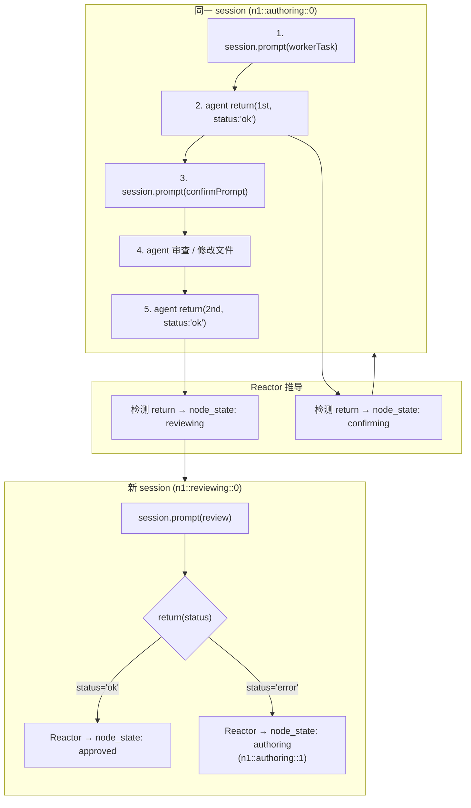
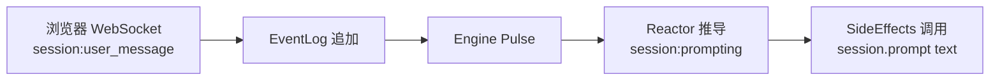

# Squad-Tau PRD — 03 会话体系

## 3.0 确定性 URN 寻址

**核心公理**：系统中不存在任何随机 ID。所有实体 ID 由确定性公式计算得出。

### SessionID 公式

```
sessionId = `${nodeId}::${phase}::${retryCount}`
```

其中：
- `nodeId`：节点文件名（不含 `.toml`），如 `auth-base`、`login`。外层 review 会话使用 `or` 作为 nodeId
- `phase`：`authoring`、`confirming`、`reviewing`、`outer_review`
- `retryCount`：从 0 开始的整数。重试后退回 authoring 时递增，reviewing 阶段失败后重置为 (node.retryCount + 1)

**示例**：
- `auth-base::authoring::0` — auth-base 节点的第一次 worker 执行
- `auth-base::confirming::0` — auth-base 节点的第一次 self-confirm
- `auth-base::reviewing::0` — auth-base 节点的第一次 review
- `login::authoring::1` — login 节点的第二次 worker 执行（因 review 驳回）
- `or::outer_review::1` — 第一轮外层 review

### URN 消灭了什么

| 旧世界实体 | 替代方式 |
|-----------|---------|
| 数据库自增 ID | SessionID `n1::authoring::0` 直接编码全部语义 |
| 外键关联（session → node） | SessionID 中已包含 nodeId、phase、retryCount，通过 `sessionIdFor()` 双向可逆 |
| 连表查询（查找某个 node 的 session） | `Object.values(state.sessions).filter(s → s.nodeId === nodeId)` → O(n)，但实际上 Reactor 通过 `state.sessions[sessionId]` O(1) 直接访问 |
| 随机 ID 生成器 | 不需要了——`nodeId` 从 `.toml` 文件名派生，`phase` 从 Reactor 规则派生，`retryCount` 从状态树派生 |
| 去重判断 | 同一个 `n1::authoring::0` 只会被创建一次，因为 `state.sessions[sessionId]` 已存在时 Reactor 跳过 |

### 实现

```javascript
// shared/events.js
export function sessionIdFor(nodeId, phase, retryCount) {
  return `${nodeId}::${phase}::${retryCount}`;
}
```

这个函数是系统中的唯一 ID 生成器。没有随机数、没有 UUID、没有 Math.random()。

## 3.1 工具注册策略

所有 lifecycle 工具通过 `pi.registerTool()` **全局注册**，所有 session 共享。

| 工具 | 签名 |
|------|------|
| `delegate` | `({ plan_dir: string })` — 提交 DAG 计划目录，每节点一个 `.toml`（文件名=节点ID）；单文件=M，多文件=L；`[[review_criteria]]` 含 `name` + `description` |
| `return` | `({ status: 'ok'\|'error', reason, affected_files? })` — 返回结果。语义因调用者而异（见 §3.2） |

## 3.2 Worker 生命周期（含 Self-Confirm）

Worker 和 Self-Confirm 共用**同一个 session 对象**。工具集在 `createAgentSession` 时固定，运行中不变更。

### return 调用契约

| 场景 | 调用 | 含义 |
|------|------|------|
| Worker 提交 | 第 1 次 `return({ status:'ok', ... })` | → 进入 self-confirm（Reactor 推导 `confirming`） |
| 自审通过 | 第 2 次 `return({ status:'ok', ... })` | → 完成，进入 reviewer（Reactor 推导 `reviewing`） |
| Worker 重做 | `return({ status:'error', reason })` | → 退回 worker 阶段重做 |
| Reviewer 驳回 | `return({ status:'error', reason })` | → 节点 rejected，retryCount++，退回 worker（Reactor 推导） |
| 主会话 redo | `return({ status:'error', reason })` | → 整个 squad 任务标识需重新 `delegate` |
| 外层 review 驳回 | `{ approved: false, reason }` 通过 delegate 返回值传递 | → Reactor 检测后重置所有节点回 authoring |

`return({ status:'ok' })` 的语义在所有场景一致：当前阶段完成，Reactor 在下一次 pulse 中通过规则推导下一阶段。

### Worker 提示词结构
1. 节点任务描述
2. 上游节点结果（summary + affected_files）
3. Reviewer 反馈（重试时）
4. `review_criteria` 逐条展开：`name: description`（description 原样嵌入）
5. 必须调用 `return` 的约束

### Self-Confirm 提示词结构（关键变化）
- **发回原始任务描述**，不是 worker 提交的 reason
- `review_criteria` 逐条展开：`name: description`
- 内置 review 维度：Code Quality / Design Flaws / Security / UX / Goal Completeness
- 如需修改，改完后再次调用 `return({ status: 'ok', ... })`

### 空轮次保护
两阶段**分别**计数：Worker authoring `MAX_EMPTY_TURNS = 20`，Self-Confirm `CONFIRM_MAX_EMPTY = 5`（`empty-turns.js` 定义）。

## 3.3 Reviewer 会话

### Session 策略
- **每次新 session**：每次 review 都创建全新的 session（`SessionManager.create()`），不复用之前任何 session
- 每个 retry 轮次都是全新的 reviewer session（id 为 `n1::reviewing::0`、`n1::reviewing::1`……）

### 可用工具
Reviewer session 工具集受限：`['read', 'search', 'find', 'lsp', 'bash', 'return']`（`run-reviewer.js` 中 `buildBaseSessionOptions` + 显式 `toolNames` 覆盖），不包含 `delegate` 和 `write`/`edit` 等写操作工具

### 生命周期
```typescript
return({ status: 'ok' | 'error', reason: string })
```
- `status: 'ok'` + `reason` → approve
- `status: 'error'` + `reason` → reject，附带反馈

### 提示词结构
1. 节点任务描述
2. Worker 提交的 `reason` + `affected_files`
3. `review_criteria` 逐条展开：`name: description`（description 原样嵌入，作为评审依据）
4. 内置 review 维度

## 3.4 节点完整执行流程



## 3.5 用户 Steer 消息

用户可以在 Web UI 中向任意活跃 session（主会话、Worker、Reviewer、OuterReview）发送消息，视为 steer（引导），实时指导 agent 工作方向。

### 覆盖范围

| Session 类型 | 可 steer | 说明 |
|-------------|----------|------|
| 主会话 | 是 | 常规对话，与终端中直接输入一致 |
| Worker | 是 | 在 authoring 阶段，用户可介入调整方向、补充上下文 |
| Reviewer | 是 | 在 reviewing 阶段，用户可补充审阅标准或提前给出反馈 |
| Self-Confirm | 是（但已合并进 worker phase） | agent 两次调用 return 之间，用户消息进入 worker 上下文 |
| OuterReview | 是 | 用户可向外层 reviewer 补充整体意见 |

### 路由机制



**关键区别**：用户消息不直接发送给 LLM，而是通过 EventLog 追加事实 → Engine Pulse → Reactor 推导过渡态事实 → SideEffects 订阅执行。所有路径统一走 EventLog。

### 实现要点

- WebSocket 收到 `session:user_message` → 追加 `session:message`（角色=user，用于 UI 同步）和 `session:user_message_received`（触发脉冲推导）
- Reactor 检测新的 `session:user_message_received` → 推导 `session:prompting` → SideEffects 调用 `session.prompt(text)`
- 已结束的 session（completed / aborted）拒绝接收用户消息，Web UI 会禁用输入框
- 用户消息在 session 的 JSONL 文件中正常记录，与终端输入的消息等效

## 3.6 消息事件桥接

session 事件通过 `session.subscribe(callback)` 订阅，回调接收原始事件对象而非命名事件。事件桥接在 `session-events.js` 中完成：

| session 事件 | WebSocket 事件类型 |
|-------------|-------------------|
| `message_update`（含 text_delta/thinking_delta） | `session:message_delta` |
| `tool_execution_start` | `session:tool_call` |
| `tool_execution_end` | `session:tool_result` |
| `message_end` | `session:message` |

这些事件直接追加到 EventLog（`message_delta` 和 `thinking_delta` 除外——它们仅是流式广播，不入持久日志）。

### 空轮次上限汇总

| 阶段 | 最大空轮次 | 代码常量 |
|------|-----------|---------|
| Worker authoring | 20 | `MAX_EMPTY_TURNS` |
| Self-Confirm | 5 | `CONFIRM_MAX_EMPTY` |
| Reviewer | 20 | `REVIEWER_MAX_EMPTY` |
| Outer Review | 20 | `OUTER_REVIEW_MAX_EMPTY` |
