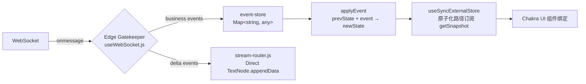
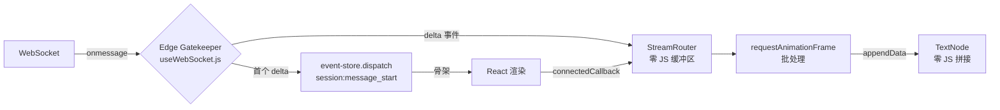

# Squad-Tau PRD — 04 Web UI 实时镜像

**核心哲学**：UI 是完全的贫血投影（Anemic Projection）。React 不维护任何业务状态、无 `useState` 局部状态、无 Reducer 计算逻辑。**前后端同构投影（CQRS）**——WebSocket 推送的事件数组直接输入到共享的 `applyEvent` 函数，React 的渲染只需 O(1) 地绑定这个折叠后的 State 对象。

**所有用户交互（包括侧边栏切换、折叠面板、对话框开闭）都通过 `ui:xxx` 事件进入 EventStore**。React 组件内部不存在任何对于业务状态的 `useState` 或 `useContext`。

## 4.1 技术栈

| 层 | 技术 | 版本 |
|----|------|------|
| 框架 | React | 18.3.x |
| UI 组件 | @chakra-ui/react | 3.x |
| 图标 | lucide-react | latest |
| DAG 可视化 | beautiful-mermaid | latest |
| 通信 | WebSocket (原生) | — |
| 构建 | vite | 8.0.x |
| 语言 | JavaScript (JSX) | — |

## 4.2 架构原则

- **无业务状态**：React 不维护任何 squad 业务逻辑。所有状态来自同构投影 `shared/projections.js`。
- **无 `useState`/`useContext`**：侧边栏展开/折叠、Drawer 开闭、DAG 视图切换等所有 UI 状态通过 `ui:xxx` 事件 → EventStore 折叠 → `useSyncExternalStore` O(1) 绑定。组件内部仅存储 ref 和 RAF 句柄。
- **同构投影（CQRS）**：前端通过 `event-store.js` 维护一个 EventLog 副本。每次收到 WebSocket 事件，调用 `shared/projections.js` 的 `applyEvent()` 增量折叠。React 组件直接绑定 fold 结果。
- **原子化微订阅**：使用 `useSyncExternalStore` 订阅 `event-store.js` 的单个键路径。组件仅订阅自己渲染所需的最小字段，不订阅整个 state 对象。消息列表的每一条消息由独立 `MessageItem` 组件订阅自己的 `messageId` 字段——十万条消息更新时，仅被影响的那一条触发重渲染，其余组件 O(1) 跳过。
- **Delta 渲染**：只传输增量数据（新消息、状态变更），不全量同步。前端通过 `sync` 请求（携带上一次收到的 seq）在断线重连后补齐。
- **事件驱动**：状态变更即刻推送，无需客户端轮询或刷新。
- **单向数据流**：用户操作（消息、模型池配置修改）→ WebSocket → EventLog 追加 → Engine Pulse → Reactor 推导 → Projection → React 重新绑定。

### 数据流全景

## 4.3 UI 布局

布局：上 Header（品牌标识 + 连接状态 + 操作按钮），下分 Sidebar（Session Tree 双层树）和 Main Content（顶部 DAG View 可折叠 + 消息列表 + 底部输入框）。

## 4.4 侧边栏（Sidebar）

### Sessions Tree（扁平混合树）
- Chakra 混合布局：顶部 "DAG Overview" 节点（带 `Network` 图标）→ 按 nodeId 分组的 Node → 阶段子节点 → 无 nodeId 的游离 session
- **增量更新**：Tree contents 由 `useMemo` 从 sessions + nodes 重新计算
- **排序规则**：两层均按 session 创建时间升序排列（自然数 session ID 递增即创建时间升序）
- 各状态使用 lucide-react 图标

### 导航逻辑
- **从不自动切换**：用户始终手动选择要查看的会话，不存在 auto-follow 或锁定的概念
- 点击侧边栏树节点 → 发送 `ui:select_session` 事件 → EventStore 折叠 → 组件重新绑定 `state.ui.activeSessionId`
- 点击 "DAG Overview" → 发送 `ui:set_view_mode { viewMode: 'dag' }` 事件

## 4.5 Header

- **左侧**：`Squad-Tau` 品牌标识
- **中间**：连接状态指示器，显示端口号，使用 Chakra `Badge` + lucide `Wifi` / `WifiOff` 图标
- **右侧**：模型池配置按钮（Cog 图标）+ Abort 按钮（Stop 图标，仅在 squad 活跃时显示）
- **深色**：跟随系统 `prefers-color-scheme`，Chakra 内置 color mode

## 4.6 主内容区（MainContent）

### DAG View（全屏视图）
- 使用 `beautiful-mermaid` 渲染 SVG
- 仅在 `squad:node_state` 事件引起 state 变更时重绘，不因无关事件触发

### 消息渲染
- **角色区分**：不同角色使用不同左边框色带：主会话蓝色、Worker 绿色、Reviewer 橙色、Outer Review 紫色
- **User 消息**：右对齐，蓝色背景
- **Assistant 消息**：左对齐，默认背景
- **System 消息**：居中，斜体，灰色
- **Thinking 块**：可折叠（Chakra `Collapse` 组件）
- **Tool 调用**：使用 Chakra 风格卡片，默认全部折叠

### Edge Gatekeeper & Custom Element 流式渲染（纯净物理隔离）

高频 Thinking/Text delta **在 WebSocket 接收边缘即被物理分流**，Never 进入 EventStore。
EventStore 对 delta 事件完全失明——它的字典里没有"流"的概念。

**关键原则**：
- **物理级物理分流**：`useWebSocket.js` 的 `ws.onmessage` 根据事件类型执行分裂——`session:message_delta` 和 `session:thinking_delta` 直接调用 `streamRouter.dispatch()`，永不触碰 `eventStore.dispatch()`。EventStore 的内部没有一行 `if (delta)` 代码。
- **零 JS 缓冲区**：`StreamRouter` 不再维护 `text: []`/`thinking: []` 数组。每个 Token 作为单字符串累加器（per-key string），RAF 时直接 `TextNode.appendData()`。无 array push、无 `.join('')`、无 GC 微卡顿。
- **Custom Element `<stream-sink>`**：React 渲染时只输出空标签 `<stream-sink session-id="x" message-id="y">`。该元素在 `connectedCallback` 中创建自己的 `TextNode` 并注册到 `StreamRouter`。StreamRouter 直写 TextNode——React 对流数据完全不可见。当流结束，React 用完整内容替换掉 `<stream-sink>`。
- **首 Token 仲裁（Edge Gatekeeper）**：`streamRouter.dispatch()` 返回 `isFirst`（是否首个 delta）。若真，WebSocket handler 发射 `session:message_start` 到 EventStore。EventStore 像处理任何普通业务事件一样折叠它，创建 `streaming: true` 的骨架消息。后续所有 delta 对 EventStore 不可见。
- **`useStreams` hook**：订阅 StreamRouter 发射的 `streamsink-start`/`streamsink-end` DOM 自定义事件，维护 `Set<messageId>`。这是 React 中与流相关的唯一状态——永远不包含文本内容。
- **`session:message_start`（非 delta）**——由 Edge Gatekeeper 在首 Token 时发射。EventStore 像处理普通事实一样处理它，创建 `{ streaming: true, content: [], joinedText: '' }` 骨架。

**对比旧 Hollow DOM 模式**：旧架构中 `MessageItem` 依靠 `useRef` + `useEffect` 手动注册/注销容器到 StreamRouter，React 生命周期与流引擎指针强耦合；`StreamRouter` 内部维护 JS 字符串分片数组，每帧 `join('')` 引发 GC；`ResizeObserver` 在主线程强制 Layout Thrashing。新架构用 Custom Element 原生生命周期彻底切断耦合，零 JS 缓冲区消除 GC，CSS Scroll Anchoring 消灭重排。

### Auto-scroll 行为
- 默认浏览器原生锁定底部：`overflow-anchor: auto` + 不可见底部锚点元素
- **零 JS 介入**：CSS Scroll Anchoring 由浏览器合成器负责，不占用主线程。当原生文本节点因 `appendData()` 膨胀时，浏览器自动锁定视口到底部。无 ResizeObserver、无 `scrollTop` 读取、无 Layout Thrashing。
- 当用户手动向上滚动查看历史时，自动滚动暂停（浏览器原生行为）
- 用户向上滚动后，底部显示浮动按钮（lucide `ArrowDown` 图标），点击调用 `scrollTo({ top: scrollHeight, behavior: 'smooth' })` 恢复底部。按钮显隐通过被动 scroll 事件监听（`passive: true`）

### 空状态
无 squad 运行时显示欢迎引导：
- 标题："Welcome to Squad-Tau"
- 说明："Type `/squad <task>` in your terminal to start."
- 按钮：模型池配置按钮

### 消息输入

消息列表底部显示输入区域**仅当有活跃 session 时**（`MainContent.jsx` 中 `{activeSession && <MessageInput .../>}`）。

- Chakra `Textarea`（支持多行）+ `Button`（发送），支持 Enter 发送，Shift+Enter 换行
- 消息通过 WebSocket 发送 `session:user_message`
- 使用乐观消息（messageId 以 `opt_` 前缀）立即显示

## 4.7 模型池配置面板

- Chakra `Drawer` 组件（从右侧滑出）
- 点击 Header 的模型池配置按钮 → 发送 `ui:toggle_drawer { open: true }` 事件

### 配置
- 仅包含 `maxWorkers` 滑块/输入框
- 实时生效：每次操作发送 `model_pool:update` → 服务端处理 → `model_pool:changed` 广播

## 4.8 深色模式

- 自动跟随系统主题：`matchMedia('(prefers-color-scheme: dark)')`
- 所有组件继承 Chakra 原生暗色主题，无需额外样式

## 4.9 移动端适配
- 最佳努力（best effort）支持，不单独开发移动端 UI
- 利用 Chakra 原生响应式能力

## 4.10 安全

- HTTP + WebSocket 服务器默认绑定 `127.0.0.1`（仅本地可访问）
- 不实现身份认证——绑定 localhost 已满足单用户场景安全性
