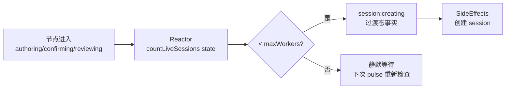
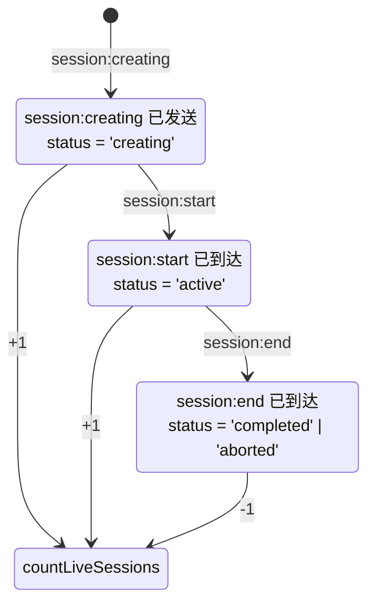
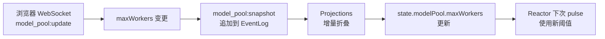
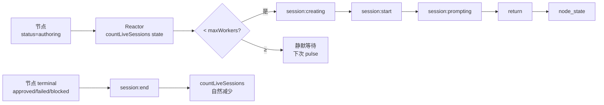

# Squad-Tau PRD — 06 并发与资源约束

**核心哲学**：模型池已被彻底虚无化。不存在 `ModelPool` 类、不存在「槽位（Slot）」、不存在 `acquire()`/`release()`、不存在等待队列。并发仅仅是**代数不等式** `countLiveSessions(state) < maxWorkers`。

## 6.1 数学模型

```
模型池 = { maxWorkers: number }

并发条件: countLiveSessions(state) < maxWorkers
```

**模型池就是一个包含 `maxWorkers` 整数的静态字典。仅此而已。** 没有槽位数组、没有使用表、没有角色区分（worker/reviewer 共用并发上限）。

### countLiveSessions 定义

```javascript
function countLiveSessions(state) {
  let count = 0;
  for (const sess of Object.values(state.sessions)) {
    if (sess.status !== 'active' && sess.status !== 'creating') continue;
    // 不计入不属于当前 pulse 的 session
    if (!sess.nodeId) { count++; continue; }
    const node = state.squad.nodes[sess.nodeId];
    if (!node) continue;
    if (node.status === sess.phase && node.retryCount === sess.retryCount) count++;
  }
  return count;
}
```

### 并发决策树



**这不是等待队列**。Reactor 只是单次脉冲中没有推导出 action。当下次脉冲来临时（由任意后续事实触发），不等式可能已满足，Reactor 自然会推导 session:creating。

### 执行中的相位



## 6.2 配置文件

- 路径：`{cwd}/.omp/models.toml`
- 唯一有效字段：`maxWorkers`（默认 3）。其他字段被忽略。

```toml
maxWorkers = 5
```

**旧格式兼容**：如果配置文件中包含 `[[slot]]` 数组，系统提取其数组长度作为 `maxWorkers`，而不是创建槽位。

## 6.3 数据流



**配置持久化**：变更时同步写入 `.omp/models.toml`，使用 `fs.watchFile` 监听外部修改。

## 6.4 浏览器端实时调整

### 工作机制
1. 浏览器发送 `model_pool:update` WebSocket 消息，payload 包含新 `maxWorkers` 值
2. 服务端收到后追加 `model_pool:snapshot` 事实到 EventLog
3. 同时持久化到 `.omp/models.toml`
4. EventLog 变更触发 Engine Pulse → Projections 更新 → `model_pool:changed` 广播到所有连接
5. 所有浏览器收到变更后通过 applyEvent 更新本地 State → UI 自动反映新阈值

### 调整效果

| 操作 | 效果 |
|------|------|
| 增大 `maxWorkers` | 下次 pulse 不等式更易满足，更多节点可同时执行 |
| 减小 `maxWorkers` | 不等式更紧，超出阈值的 session 在完成后不再创建新的 |

**永远不需要"释放"或"回收"**。减小 `maxWorkers` 不会中断正在执行的 session——已分配的继续运行。只有在现有 session 自然结束后，新 session 才按新阈值裁决。

## 6.5 已删除的概念

| 已删除 | 原因 | 替代 |
|--------|------|------|
| 槽位（Slot） | 物理槽位是硬件思维的残余，系统不需要 | `maxWorkers` 整数 |
| `acquire()` | 拟人化的"申请"掩盖了代数学本质 | `countLive < maxWorkers` |
| `release()` | 显式释放暗示了所有权管理 | session 终结后自动不被计数 |
| 等待队列（Queue） | 队列是命令式原语 | Reactor 脉冲的自然间歇 |
| 角色区分（worker/reviewer） | 角色间不存在资源隔离需求 | 共享 `maxWorkers` 上限 |
| 使用表（usage Map） | 槽位统计的副产品 | 纯 `countLiveSessions` 函数 |
| 防抖定时器 | 文件 I/O 合并优化（已随 ModelPool 类移除） | 无 |

## 6.6 与 Squad 引擎的集成

### 工作流程（纯事实驱动）



### 无限并发
- 不设硬编码并发上限。并发度仅受 `maxWorkers` 值约束。
- `maxWorkers` 为 0 或未设置时，`countLiveSessions(state) < 0` 始终不成立，所有节点静默等待。
- 无信号量、无 Promise.race、无异步队列——纯 EventLog + 代数不等式。
