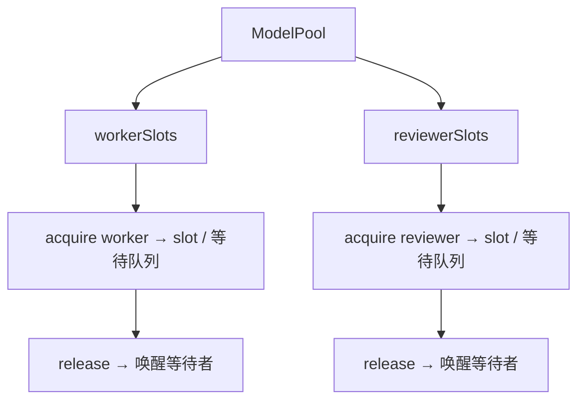
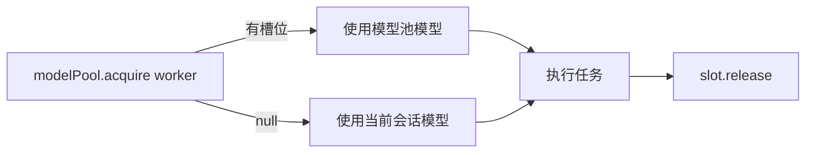

# Squad-Tau PRD — 06 模型池管理

## 6.1 配置文件

- 路径：`{cwd}/.omp/models.toml`（当前工作目录下的 `.omp/models.toml`）
- 格式示例：
```toml
[[slot]]
provider = "anthropic"
model_id = "claude-3-5-sonnet-20241022"
role = "worker"
thinking_level = "medium"

[[slot]]
provider = "anthropic"
model_id = "claude-3-5-haiku-20241022"
role = "reviewer"
```

## 6.2 并发模型



- Worker 和 Reviewer 使用独立的槽位队列
- `acquire(role, signal)` 是异步操作：
  - 有空闲槽位 → 立即返回
  - 无空闲槽位 → 挂起直到有槽位释放或 signal.aborted
- `release()` 释放槽位，唤醒等待者
- 同一配置行可重复（例如 3 行相同的 worker 配置 = 3 并发）
- 引用计数：acquire 标记 inUse，release 清除标记

## 6.3 浏览器端实时调整

### 工作机制
1. 浏览器发送 `model_pool:update` WebSocket 消息
2. 服务端收到后：
   - 更新 `.omp/models.toml` 文件
   - 更新内存中的 ModelPool 实例（增/删/改槽位）
   - 广播 `model_pool:changed` 到所有连接
3. 所有浏览器收到变更后更新 UI

### 操作类型

| 操作 | 行为 |
|------|------|
| `add` | 在内存和文件中插入新槽位，新槽位初始为可用状态 |
| `remove` | 删除槽位，如果正在使用则等待释放后删除（或在下次 release 时删除） |
| `edit` | 修改 `thinkingLevel`，不影响正在运行的任务 |

### 注意事项
- 删除正在使用的槽位 → 标记为 `pending_delete`，release 时真正删除
- 编辑不影响运行中任务的 thinkingLevel
- 新增槽位立即生效，等待队列中的 acquire 会立即分配到新槽位

## 6.4 与 Squad 引擎的集成

### 模型分配优先级
1. **优先使用模型池**：Squad 引擎在执行节点前调用 `modelPool.acquire(role)` 获取模型槽位
2. **回落到当前会话模型**：如果模型池为空（无任何配置），或 acquire 超时/失败，使用主会话正在使用的模型
3. **当前会话模型无上限**：使用当前会话模型时不做并发限制，多个 worker 可同时使用

### 工作流程


### 其他
- 节点执行完毕后（无论成败）调用 `slot.release()`
- 如果 signal.aborted，acquire 立即 reject，外层捕获后终止节点
- **无限并发**：不设硬编码并发上限，并发度仅受模型池槽位数限制。槽位越多，并行度越高

## 6.5 文件变更同步

- 除了浏览器端修改，用户可能直接编辑 `.omp/models.toml`
- 使用 `fs.watchFile` 监听配置文件变更
- 检测到文件变更后：
  1. 重新读取配置文件
  2. 对比内存中的 ModelPool 状态
  3. 更新 ModelPool 实例（增/删/改槽位，不影响正在运行的任务）
  4. 广播 `model_pool:changed` 事件到所有 WebSocket 客户端
- 注意：直接删除配置文件中正在使用的槽位时，行为与浏览器删除一致（标记为 pending_delete，release 时真正删除）
