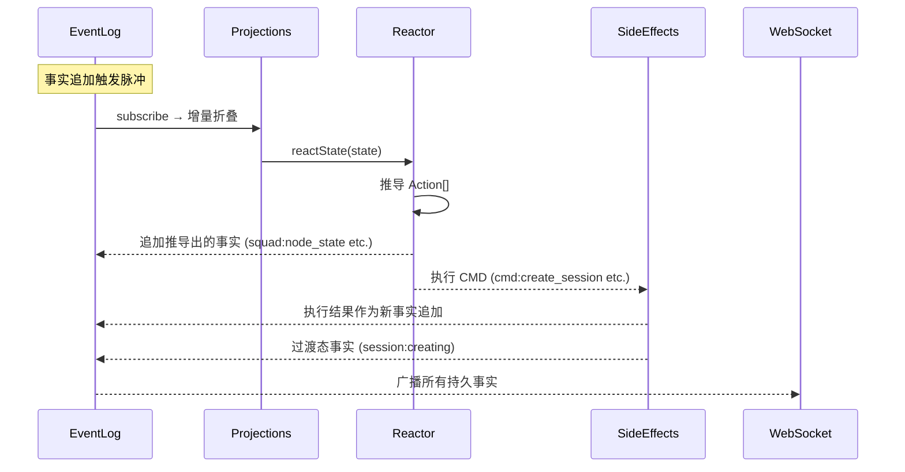

# Squad-Tau PRD — 07 技术架构

## 7.1 结构与拆分原则

### 顶层布局
```
squad-tau/
├── index.js          # 插件入口
├── server/           # 服务端（Node.js）
├── client/           # 前端（React SPA）
├── shared/           # 前后端共享代码
├── test/             # 测试
├── package.json
├── README.md
└── SPEC.md
```

### 拆分原则
- 单函数 ≤40 行，超限必须拆解
- 单文件 ≤200 行，超限必须拆解
- 按功能模块拆分：一个逻辑单元拆为多个文件
- 文件名 kebab-case（服务端），PascalCase（组件），camelCase（hooks）
- 测试文件与被测文件同名，`.test.js` 后缀

### 模块分组

| 组 | 职责 | 文件模式 |
|----|------|--------|
| **真理源** | EventLog 追加式事实日志 | `event-log.js` |
| **推导引擎** | Engine Pulse + Reactor 纯函数 | `engine.js`, `reactor.js` |
| **物化视图** | 前后端同构增量折叠 | `shared/projections.js`, `shared/events.js` |
| **肌肉层** | Session 创建、prompt 发送、文件 I/O | `side-effects.js`, `*-prompt.js`, `session-options.js`, `session-events.js` |
| **模型池** | 配置文件读写 + 槽位同步 | `model-pool-config.js`, `model-pool-events.js` |
| **网络** | HTTP 服务器、WebSocket、心跳、事件桥接 | `http-*`, `ws-*`, `server-lifecycle.js` |
| **验证** | Plan 验证 | `validate-plan.js`, `dag-validate.js` |
| **前端** | React 组件、hooks、事件存储 | `*.jsx`, `use*.js`, `event-store.js` |
| **测试** | 代数断言、时空折叠、真实混沌 | `*.test.js` |

## 7.2 服务端组件

### 7.2.1 核心数据流



### 7.2.2 HTTP + WebSocket
- **插件加载时即启动**，不依赖 `/squad` 命令
- **端口 OS 随机分配**（`server.listen(0, '127.0.0.1')`）
- Vite `createServer` Node API 处理 JSX/HMR/静态资源（通过 `@oh-my-pi/resolve-pi` 的 `importNodeModule` 动态加载）
- WS `ws://127.0.0.1:<port>/ws`：双向 JSON，心跳 30s ping / 60s 超时
- `session:user_message` → EventLog 追加 → Engine Pulse 路由
- 服务端使用**引用计数**管理生命周期（`_refCount`），允许多次启动调用不冲突
- Vite 使用**惰性初始化**（`createViteDevServer` 返回懒加载中间件，首次请求时才启动 Vite）
- HTTP 服务器使用自制中间件栈（`http-server.js` 中 `createApp()`），而非 Express/Koa
- **无 EventBus**：所有事件通过 EventLog `subscribe` 桥接到 WebSocket 广播

### 7.2.3 EventLog（真理源）
- `class EventLog` 内部维护 `Array<{id, event, payload, timestamp}>`
- `append(event, payload)` → 追加条目 → 通知所有 listeners
- `subscribe(listener)` → 注册回调 → 返回 unsubscribe
- `getSince(cursor)` → 返回 `cursor` 之后的所有条目（用于连接时全量回放 + sync 补齐）
- 流式事件（`message_delta`, `thinking_delta`）不入持久数组，仅广播

### 7.2.4 Engine（引擎脉冲）
- 订阅 EventLog 的新条目 → 设置 dirty 标志
- `queueMicrotask` 合并多次追加到同一次 pulse
- pulse 中：`reactState(state)` → Action[] → 循环执行（事实追加 → 再触发 pulse）
- CMD 执行前先追加过渡态事实，防止 Reactor 重复推导
- 用户消息通过 EventLog 水位线检测（`getSince(lastUserMsgSeq)`）发现，非 log 扫描

### 7.2.5 Reactor（推导大脑）
- 纯函数 `reactState(state) → Action[]`
- 不可包含任何 `eventLog.getSince()`、`.find()` 扫描
- 输入仅为 `shared/projections.js` 折叠后的 State 对象
- 内置 sub-reactors：
  - 初始状态推导（undefined → idle）
  - 模型释放（terminal 节点 → release）
  - 外层 Review 闸门（全部 approved → 外审 / 完成）
  - 节点状态机（idle → authoring → confirming → reviewing → approved）
- 并发通过**槽位差值**自然收敛：`Available = Total - usage.length`

### 7.2.6 Side Effects（肌肉层）
- Fire-and-Forget 命令处理器
- `handleCreateSession`：调用 `createAgentSession` → 追加 `session:start` 事实
- `handlePrompt`：根据 phase 构建 prompt 文本 → 调用 `session.prompt()` → 会话异步流经 EventLog 广播
- `handleUserMessage`：转发用户输入到活跃 session
- **无业务状态**：session 句柄存储在本地 Map（`sessionStore`），不可序列化到 EventLog
- **无 async/await 业务挂起**：所有调用是"发后即忘"（Fire-and-Forget）

### 7.2.7 模型池（纯配置 + 投影）
- `model-pool-config.js`：`.omp/models.toml` 读写 + `fs.watchFile` 监听
- `model-pool-events.js`：WebSocket 消息 → EventLog 追加 + 文件持久化
- 无 `ModelPool` 类、无 `acquire()`/`release()` 方法、无等待队列
- Reactor 直接从 `state.modelPool` 投影读取槽位占用情况

### 7.2.8 其他
- 常量/状态枚举：`constants.js`
- `validate-plan.js`：验证 `.toml` 文件格式
- `dag-validate.js`：DAG 环检测 + 未知节点依赖检查（纯验证，不排序）
- `lifecycle-tools.js`：`return`、`delegate` 工具注册
- `view-manager.js`：紧凑 console widget，显示节点进度

## 7.3 构建与开发模式

- **纯 JavaScript**：前后端全部使用 JavaScript（JSX），不引入 TypeScript
- **Dev 模式优先**：前端目前只考虑开发模式，不打包
- Vite Node API 内联创建 dev server（通过 `@oh-my-pi/resolve-pi` 的 `importNodeModule` 动态解析）
- Vite 自动处理：JSX 转换、静态资源
- 开发时修改前端源码即时生效，无需手动刷新

### 7.3.1 命名约定
- 所有服务端文件使用 kebab-case（`model-pool-config.js`）
- 所有客户端文件使用 PascalCase 组件名（`Header.jsx`）或 camelCase hooks（`useWebSocket.js`）
- 测试文件后缀 `.test.js`，与被测试文件同名

### 7.3.2 Vite 惰性加载

`createViteDevServer()` 返回惰性中间件：
- 首次请求时才初始化 Vite（`startPromise` 确保并发请求只创建一次）
- HMR 禁用（`hmr: false`）以避免与 `ws` 服务器的 WebSocket 冲突

## 7.4 依赖关系

```
Runtime deps:
  ws                        -- WebSocket server (bundled dependency)
  vite                      -- Dev server (bundled dependency)
  @chakra-ui/react          -- UI components
  lucide-react              -- Icons
  react / react-dom         -- UI framework
  beautiful-mermaid         -- DAG visualization
  @oh-my-pi/resolve-pi      -- OMP 模块解析器

Dev deps:
  puppeteer                 -- E2E tests
  bun:test                  -- Bun test runner (built-in)
```

所有依赖通过 `@oh-my-pi/resolve-pi` 的 `importNodeModule` 动态解析，而非直接 `import`。

所有 tau-mirror 功能全部内联实现。

## 7.5 文件规模统计

| 区域 | 文件数 | 最大行数 | 说明 |
|------|--------|----------|------|
| server/ | ~20 个 JS | ≤200 | EventLog、Engine、Reactor、SideEffects、网络层 |
| client/ | ~20 个 JSX/JS/CSS | ≤200 | 组件、hooks、entry、样式 |
| shared/ | 2 个 JS | ≤200 | projections.js, events.js |
| test/ | ~15+ 个 JS | ≤200 | unit + integration + e2e + helpers |
| 根目录 | 3 个 | ≤200 | index.js, package.json, README.md |
| **总计** | **~60+ 个文件** | **≤200** | |
