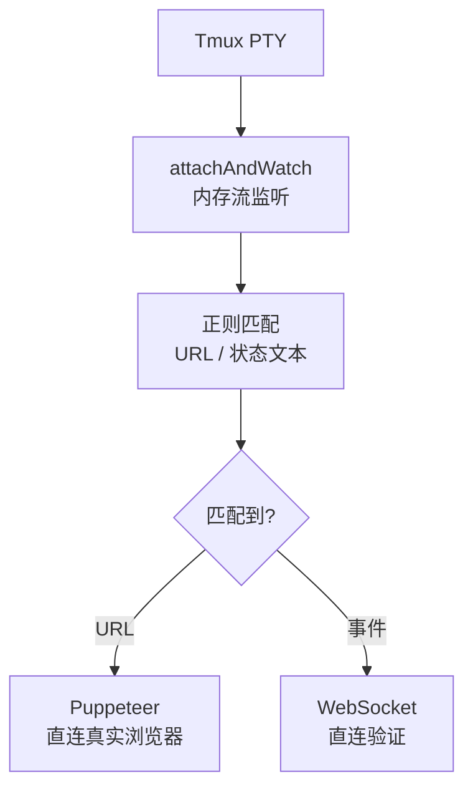

# Squad-Tau PRD — 08 测试策略

**核心哲学**：不再使用 Puppeteer DOM 轮询 + Mock 等待时序 + setInterval 轮询。新测试架构建立在系统的数学本质之上——Reactor 是纯函数，测试就应该像代数断言一样确定、零耗时。

## 8.1 三神级防线

```mermaid
graph TD
    subgraph 顶层【幽灵 PTY】
        SIM[simulation.js\n物理链路 Tmux + 管道挂载\n不落盘、不轮询、不 setInterval\n验证真实环境因果律]
    end
    subgraph 中层【时空折叠器】
        TT[time-traveler.test.js + fuzzing.test.js\n内存 while 循环 + 伪造 SideEffect\n1ms 推演 200 步宇宙流转]
    end
    subgraph 底层【代数断言】
        ALG[state-builder Fluent DSL\n给定静态 State 树 → 断言 Action[]\n0ms 执行 · 100% 边界覆盖]
    end
```

| 层 | 执行时间 | 数量级 | 运行频率 | 依赖 |
|---|----------|--------|----------|------|
| 代数断言 | ~0ms（纯函数） | 大量（50+ 场景） | 每次提交 | 无 |
| 时空折叠器 | ~1ms（内存循环） | 中量（10+ 场景） | 每次提交 | 无 |
| 幽灵 PTY | ~30s（物理链路） | 少量（2-3 场景） | 释放前 | OMP + Tmux + Puppeteer |

## 8.2 底层：代数断言

**原理**：Reactor 是纯函数 `f(State) → Action[]`。测试直接构造输入 State，断言输出的 Action 数组符合预期。

**Fluent DSL**（`test/helpers/state-builder.js`）：

```javascript
// 构造三节点菱形 DAG
const state = buildState({
  nodes: [
    { id: 'n1', depends_on: [] },
    { id: 'n2', depends_on: ['n1'] },
    { id: 'n3', depends_on: ['n1'] },
  ],
  maxWorkers: 5,
});

// 设置 n1 为 approved
setStatus(state, 'n1', 'approved');

// Reactor 推导 → 应解锁 n2 和 n3
const actions = reactState(state);
expect(actions.filter(a =>
  a.type === 'squad:node_state' && a.payload.status === 'authoring'
).length).toBe(2);
```

**核心断言类别**：

| 类别 | 断言内容 | 边界值 |
|------|----------|--------|
| 初始状态 | SQUAD_INIT 后，所有节点得到 idle 状态 | 0 节点 / 1 节点 / N 节点 |
| 依赖传导 | 上游 failed → 下游 blocked | 链式/菱形/扇出 |
| 并发闸门 | 节点数 > maxWorkers → 恰好 maxWorkers 个 session:creating | 超限/正好/空 |
| 阶段推进 | 有 return('ok') → 下一 node_state | authoring→confirming→reviewing→approved |
| 驳回重试 | return('error') + retryCount < MAX → 回 authoring | retryCount = 0..MAX-1 |
| 超限失败 | return('error') + retryCount >= MAX → failed | MAX 边界 |
| 外层 review | 全部 approved → SQUAD_OUTER_REVIEW_START | M 模式 / L 模式 |
| 外层驳回 | 外审 rejected → 节点重置回 authoring | retryCount 递增 |
| 确定性 URN | sessionId = `${nodeId}::${phase}::${retryCount}` | 不同类型的 phase/retry |

### 关键测试文件

| 文件 | 覆盖 |
|------|------|
| `test/unit/reactor-orthogonal.test.js` | 正交单元测试：每个规则独立验证 |
| `test/unit/reactor-dag-invariants.test.js` | DAG 因果律不变量：依赖链、环、菱形 |
| `test/unit/reactor-failure-paths.test.js` | 失败路径：驳回、超限、阻塞、中止 |
| `test/unit/reactor-squad-complete.test.js` | 完成路径：各种模式的 squad:complete 触发 |
| `test/unit/reactor-outer-review.test.js` | 外层 review 规则 |
| `test/unit/reactor-chain-trace.test.js` | 链式追踪：事件序列的顺序不变性 |

## 8.3 中层：时空折叠器（Time-Traveler）

**原理**：模拟完整的 Engine Pulse 循环——在内存 `while` 循环中反复调用 `reactState()` + 伪造 SideEffect 执行业务动作 + 将结果追加回 EventLog，直到反应链收敛。

```javascript
function timeTravel(initialEvents, promptBehavior, maxSteps = 200) {
  const eventLog = new EventLog();
  for (const ev of initialEvents) eventLog.append(ev.type, ev.payload);
  
  let step = 0;
  while (step < maxSteps) {
    const state = project(eventLog.getSince(0));
    const actions = reactState(state);
    if (actions.length === 0) break;  // 收敛
    
    for (const action of actions) {
      if (action.type === 'session:creating') {
        // 伪造 SideEffect：直接 append session:start
        eventLog.append('session:start', {
          sessionId: action.payload.sessionId, ...
        });
      }
      if (action.type === 'session:prompting') {
        // 伪造 LLM 行为 → 调用 promptBehavior 回调
        const result = promptBehavior(action.payload.sessionId);
        // 将 return 结果写回 EventLog
        eventLog.append('session:tool_call', {
          sessionId: action.payload.sessionId,
          toolName: 'return',
          params: result,
        });
      }
      // 持久事实直接追加
      if (!action.type.startsWith('session:')) {
        eventLog.append(action.type, action.payload);
      }
    }
    step++;
  }
  return project(eventLog.getSince(0));
}
```

**这完全跳过异步 I/O**——所有 LLM 调用被替换为 `promptBehavior` 回调函数，直接返回 `{status: 'ok' | 'error'}`。循环在单线程内推演整个 DAG 生命周期。

### 验证的不变量

| 不变量 | 验证方式 |
|--------|----------|
| DAG 因果律 | 任意时间点，下游节点绝不早于上游节点进入 authoring |
| 并发上界 | 任何时刻 `countLiveSessions(state) ≤ maxWorkers` |
| 最终收敛 | while 循环始终在有限步内终止（200 步硬限 + 断言收敛） |
| 最后事件 | `squad:complete` 总是最后一个事件 |
| 确定性 | 相同输入 + 相同 promptBehavior → 完全相同的结果 EventLog |
| URN 不变性 | 所有 sessionId 符合 `${nodeId}::${phase}::${retryCount}` 模式 |

### 关键测试文件

| 文件 | 覆盖 |
|------|------|
| `test/integration/time-traveler.test.js` | 主时间旅行测试：M 模式、链式、菱形、驳回、外审 |
| `test/integration/fuzzing.test.js` | 模糊推演：随机 promptBehavior、随机 DAG 结构 |

## 8.4 顶层：幽灵 PTY 直连（`simulation.js`）

**原理**：不使用硬盘文件作为 IPC 中介、不使用 `setInterval` 轮询、不使用 mock 替代真实组件。通过 Tmux 管道挂载（Pipe Attachment）拦截内存流，直接从 PTY 的标准输出流解析 URL 和事件信号。



**驱动原语**（`simulation.js`）：

| 原语 | 实现 | 特点 |
|------|------|------|
| `attachAndWatch(tmuxSess, predicate, timeout)` | `Bun.spawn` 执行 `tmux attach`，管道 `stdout` 逐块解码，ANSI 剥离后匹配 | **0 落盘**——PTY 输出直接进入内存流，不经过临时文件 |
| `awaitWsEvent(wsUrl, eventType, timeout)` | `new WebSocket` → `onmessage` 逐帧 JSON 解析 → 匹配 event type | **0 轮询**——事件驱动，状态到达即唤醒 |
| `wsPingPong(wsUrl, count, timeout)` | 批量发送 ping → 等量 pong 回复 | **因果律核查**——验证 WS 通道双向可达 |
| `setupBrowser()` | Puppeteer 启动 Chromium | **真实浏览器**——非 JSDOM、非 mock |

### 为什么不是"文件轮询"

传统 E2E 做法：进程写文件 → 测试进程轮询 `fs.watchFile` 或 `setInterval` → 读取文件内容 → 解析。

`simulation.js` 的做法：**Tmux PTY 的内存流直接挂接到测试进程的异步迭代器**。不创建任何中介文件，不浪费 CPU 轮询，不依赖文件系统时效性。

```javascript
// 伪代码对比
// ❌ 旧方式：文件轮询
setInterval(() => {
  const content = fs.readFileSync(logFile, 'utf8');
  if (content.includes('URL:')) { ... }
}, 500);

// ✅ 新方式：内存流监听
const url = await attachAndWatch(tmuxSess, (ptyText) => {
  const m = ptyText.match(/Squad UI: (http:\/\/127\.0\.0\.1:\d+)/);
  return m?.[1];  // 返回后 Promise resolve，流自动关闭
});
```

### 混沌攻击面

| 攻击面 | 验证目标 |
|--------|----------|
| Ctrl+C 连发 | 进程不死锁、不 segfault |
| 运行时浏览器刷新 | WebSocket 重连后状态完全恢复 |
| 多 Tab 一致性 | 多个浏览器看到的 UI 状态一致 |
| 暴力 steer | 自然语言消息中断 + 矛盾指令 → 最终正常完成 |
| 模型池配置操作 | 调整 maxWorkers 中执行 squad → 正确降级/恢复 |
| 多次中断 | 最后一次正常完成 |

### 关键测试文件

| 文件 | 覆盖 |
|------|------|
| `simulation.js` | 基础物理链路：页面加载、WS ping/pong、squad:init→complete 全流程 |
| `test/e2e/chaos-ui-e2e.test.js` | 浏览器端混沌：多 Tab 同步、面板操作 |
| `test/e2e/ui-full-flow.test.js` | UI 全流程：交互时序、消息渲染 |

## 8.5 测试执行策略

```bash
# 日常开发（毫秒级）
bun test test/unit/reactor-*.test.js
bun test test/integration/time-traveler.test.js

# 提交前（秒级）
bun test test/unit/ test/integration/

# 释放前（分钟级）
SQUAD_MODEL=p-openai/gpt-5.2 bun test ./simulation.js  # 需要 omp + Tmux + Puppeteer
```

### 已移除的旧测试类型

| 旧类型 | 移除原因 | 替代方案 |
|--------|----------|----------|
| Puppeteer DOM 轮询 | 不可靠、慢、脆弱的 selector 依赖 | 代数断言验证 Reactor 输出 + 时空折叠器验证全流程 |
| Mock 等待时序 | 掩盖竞态 | 时空折叠器的同步推演暴露所有竞态 |
| setInterval 文件轮询 | CPU 浪费、竞态依赖文件系统延迟 | `attachAndWatch` PTY 内存流异步迭代 |
| EventBus 注入测试 | 模拟事件总线是假测试 | 代数断言直接输入 State 对象 |
| 模型池 acquire/release 时序 | `ModelPool` 类已删除 | `countLive < maxWorkers` 不等式的代数断言 |
